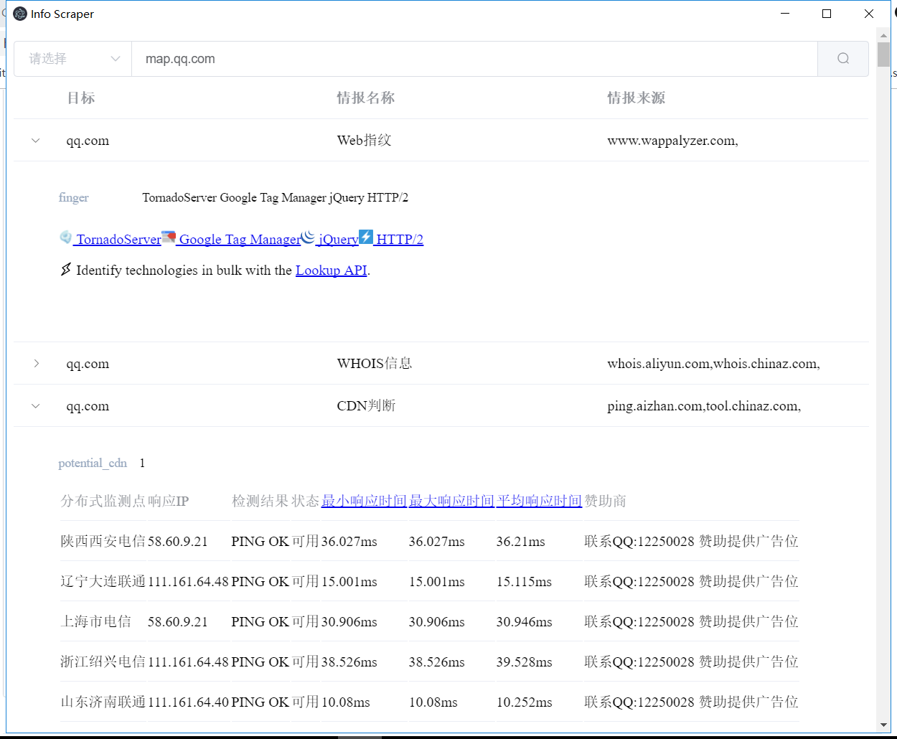

## 一个基于Electron的Web资产探测工具
工具参考链接：https://michaelwayneliu.github.io/2019/07/05/Web%E6%B8%97%E9%80%8F%E5%89%8D%E6%9C%9F%E4%BF%A1%E6%81%AF%E6%90%9C%E9%9B%86%E5%8F%8A%E8%87%AA%E5%8A%A8%E5%8C%96%E5%B7%A5%E5%85%B7%E7%BC%96%E5%86%99/

Info Scraper是一款界面友好的web应用资产探测工具，适合于渗透测试前期对目标资产的快速探测，如CDN探测、Web指纹等，项目基于NodeJS，扫描结果直接本地以列表形式展示。目前支持：CDN判断、Web指纹、WHOIS查询、子域名发现、IP反查域名、IP地理位置、IP端扫描、静态文件中敏感信息发现如API接口、邮箱，电话等


### 工具特点
- 自动化信息搜集过程，提升效率
- 探测结果实时展示，无需刷新
- 探测过程模块化，支持个人对模块进行定制
- 页面敏感信息提取，增强的正则匹配
- 支持HTML展示，无需烦人的标签提取工作
### 技术栈
- VUE JS
- ELEMENT UI
- Electron
- Nightmare JS
- LOWDB
- cheerio
### 安装及启动方式

```
npm install 
npm start
```

### TODO
- 探测规则定制化
- 显示结果可视化程度增强
- 打包为可执行程序（目前出现一些错误）
- google hacking、综合信息查询（威胁情报、空间探测引擎）
- 爬取数据的处理、管理
- 增强CDN判断能力
